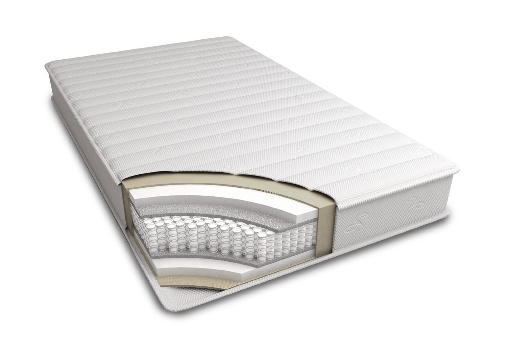

## Things that matter
* Initial cost
* [Size](https://upload.wikimedia.org/wikipedia/commons/thumb/a/ad/US_MattressSizes.svg/480px-US_MattressSizes.svg.png)
* Total cost of ownership
* Sleep quality
	* ...and non-sleep quality!

# Innerspring mattresses are a hack

* Springs are better than piles of horsehair, or whatever
* But you're sleeping on thin pieces of metal
* So we compensate!

## Box springs are a hack
* Sure, they keep your mattress off the ground
* And they're springy!
* But they wear out

# Does your current mattress suck?

Try this one cool trick!

## Other angering things
* Nearly all mattress springs are made by one company
* Mattress stores are worse than used-car dealerships
	* Perpetual sales
	* Commissions
	* Fake model numbers
	* Coil count and gauge and type and...
	* Huge discounts if you negotiate
	* Lots of hidden fees

# Help! What should I do?

## Three basic types
0. Innerspring
0. Bladder (air and water)
0. Foam (regular and memory and latex)
0. Hybrids

Note that all innerspring mattresses are hybrids, because at their core, they suck

Har har, get it?

# Some high-level points

## Don't buy an innerspring

# REALLY

## Buy online
* Bladder and foam are shippable
* Return policies are (usually) great
* Physical stores are designed to rip you off, even if you aren't buying innerspring
* Innerspring mattresses have NO compelling advantages

## What to buy
0. Air
	* If price is no object
	* If you understand the minor downsides
0. All-latex
	* If you can afford it
	* If you are willing to dive into the details
0. Hybrids
	* Foam core, foam or latex "comfort layer"

## Which one to buy
* The firmest (and cheapest!) model
	* If you sleep on your back
* The next-firmest (and cheapest!)
	* If you sleep on your side (or stomach)
* Ignore your experience with innerspring mattresses

## Don't get extra layers!

## Foundations
* Slats or solid; check what your mattress allows
* Don't buy a box spring

## Warranties
* They don't indicate actual longevity
* But longer is usually better
	* But read the fine print!
* Get a mattress protector (or two)!

## Where to buy
* [HabitatFurnishings.com](http://habitatfurnishings.com/) (all latex, all air)
* [BedInABox.com](http://bedinabox.com/) (hybrid memory foam)
* [Casper.com](http://casper.com) (hybrid latex)

[Learn more](http://www.sleeplikethedead.com/mattress-compare-type.html)
